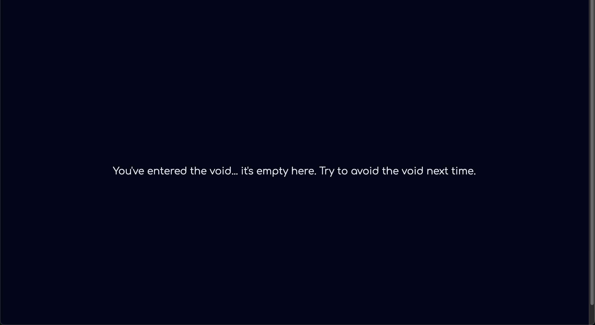

<p align="center">
  
  
  
  
  <a href="https://goreportcard.com/report/github.com/lab42/ingress-backend">
    
  </a>
  
</p>

<br/>

- [Overview](#overview)
- [Features](#features)
- [Configuration Options](#configuration-options)
  - [Example YAML Configuration File](#example-yaml-configuration-file)
- [Supported Ingress Controllers](#supported-ingress-controllers)
  - [Nginx Ingress Controller](#nginx-ingress-controller)
    - [Helm Installation](#helm-installation)
    - [Deployment](#deployment)
    - [Configure Nginx Ingress](#configure-nginx-ingress)
  - [Traefik Ingress Controller](#traefik-ingress-controller)
    - [Helm Installation](#helm-installation-1)
    - [Deployment](#deployment-1)
  - [Contour Ingress Controller](#contour-ingress-controller)
    - [Helm Installation](#helm-installation-2)
    - [Deployment](#deployment-2)
  - [Ambassador (Emissary-Ingress) Controller](#ambassador-emissary-ingress-controller)
    - [Helm Installation](#helm-installation-3)
    - [Deployment](#deployment-3)
- [Contributors](#contributors)
- [Note on Windows Support](#note-on-windows-support)
- [Contributing](#contributing)
- [License](#license)

<br/>


<h2 align="center">Overview</h2>

This Docker image provides a simple, customizable ingress-backend page solution for Kubernetes ingress controllers. Built on a scratch container, it minimizes attack vectors and enhances security. It can be used as a default backend to handle undefined or unmatched routes across various ingress implementations.

Default HTML example:




<h2 align="center">Features</h2>

- Lightweight Docker image (based on scratch for reduced attack surface)
- Customizable HTML ingress-backend page
- Easily configurable
- Compatible with multiple Kubernetes ingress controllers
- Prometheus metrics (`:8080/metrics`)

<h2 align="center">Configuration Options</h2>

`ingress-backend` can be configured using command-line arguments, environment variables, or a YAML configuration file. The following options are available:

- `--port` / `INGRESS_BACKEND_PORT`: HTTP server port (default 1234)
- `--path` / `INGRESS_BACKEND_PATH`: Root file path (not required)
- `--config`: Path to config file (default: `$HOME/.ingress-backend.yaml`)

<h3 align="center">Example YAML Configuration File</h3>

You can also use a YAML configuration file to specify options. Here's an example:

```yaml
# .ingress-backend.yaml
port: 1234
path: ""
```

The config file will be automatically loaded from your home directory if named `.ingress-backend.yaml`. Alternatively, you can specify a custom path:

```sh
ingress-backend --config path/to/config.yaml
```

<h2 align="center">Supported Ingress Controllers</h2>

<h3 align="center">Nginx Ingress Controller</h3>

<h4 align="center">Helm Installation</h4>

```bash
helm install nginx-ingress ingress-nginx/ingress-nginx \
  --set defaultBackend.enabled=false \
  --set controller.defaultBackend.enabled=false
```

<h4 align="center">Deployment</h4>

```yaml
apiVersion: apps/v1
kind: Deployment
metadata:
  name: ingress-backend-backend
spec:
  replicas: 2
  selector:
    matchLabels:
      app: ingress-backend-backend
  template:
    metadata:
      labels:
        app: ingress-backend-backend
    spec:
      containers:
      - name: ingress-backend-backend
        image: ghcr.io/lab42/ingress-backend:latest
        ports:
        - containerPort: 1234
---
apiVersion: v1
kind: Service
metadata:
  name: ingress-backend-backend
spec:
  selector:
    app: ingress-backend-backend
  ports:
  - port: 80
    targetPort: 1234
```

<h3 align="center">Configure Nginx Ingress</h3>

```yaml
apiVersion: networking.k8s.io/v1
kind: Deployment
metadata:
  name: nginx-ingress-controller
spec:
  template:
    spec:
      containers:
      - name: nginx-ingress-controller
        args:
        - /nginx-ingress-controller
        - --default-backend-service=$(POD_NAMESPACE)/ingress-backend-backend
```

<h3 align="center">Traefik Ingress Controller</h3>

<h4 align="center">Helm Installation</h4>

```bash
helm install traefik traefik/traefik \
  --set ports.traefik.expose=true
```

<h4 align="center">Deployment</h4>

```yaml
apiVersion: apps/v1
kind: Deployment
metadata:
  name: ingress-backend-backend
spec:
  replicas: 2
  selector:
    matchLabels:
      app: ingress-backend-backend
  template:
    metadata:
      labels:
        app: ingress-backend-backend
    spec:
      containers:
      - name: ingress-backend-backend
        image: ghcr.io/lab42/ingress-backend:latest
        ports:
        - containerPort: 1234
---
apiVersion: v1
kind: Service
metadata:
  name: ingress-backend-backend
spec:
  selector:
    app: ingress-backend-backend
  ports:
  - port: 80
    targetPort: 1234
```

<h3 align="center">Contour Ingress Controller</h3>

<h4 align="center">Helm Installation</h4>

```bash
helm install contour bitnami/contour
```

<h4 align="center">Deployment</h4>

```yaml
apiVersion: apps/v1
kind: Deployment
metadata:
  name: ingress-backend-backend
spec:
  replicas: 2
  selector:
    matchLabels:
      app: ingress-backend-backend
  template:
    metadata:
      labels:
        app: ingress-backend-backend
    spec:
      containers:
      - name: ingress-backend-backend
        image: ghcr.io/lab42/ingress-backend:latest
        ports:
        - containerPort: 1234
---
apiVersion: v1
kind: Service
metadata:
  name: ingress-backend-backend
spec:
  selector:
    app: ingress-backend-backend
  ports:
  - port: 80
    targetPort: 1234
```

<h3 align="center">Ambassador (Emissary-Ingress) Controller</h3>

<h4 align="center">Helm Installation</h4>

```bash
helm install ambassador datawire/ambassador
```

<h4 align="center">Deployment</h4>

```yaml
apiVersion: apps/v1
kind: Deployment
metadata:
  name: ingress-backend-backend
spec:
  replicas: 2
  selector:
    matchLabels:
      app: ingress-backend-backend
  template:
    metadata:
      labels:
        app: ingress-backend-backend
    spec:
      containers:
      - name: ingress-backend-backend
        image: ghcr.io/lab42/ingress-backend:latest
        ports:
        - containerPort: 1234
---
apiVersion: v1
kind: Service
metadata:
  name: ingress-backend-backend
spec:
  selector:
    app: ingress-backend-backend
  ports:
  - port: 80
    targetPort: 1234
```

<h2 align="center">Contributors</h2>

<a href="https://github.com/lab42/ingress-backend/graphs/contributors">
  
</a>

<h2 align="center">Note on Windows Support</h2>

Please be aware that I do not use Windows as part of my workflow. As a result, I cannot provide support for Windows-related issues or configurations. However, I do generate Windows executables as a courtesy for those who need them.

Thank you for your understanding!

<h2 align="center">Contributing</h2>

I welcome contributions to this project! If you have ideas for new features or improvements, please submit a feature request or contribute directly to the project.

<h2 align="center">License</h2>

This project is licensed under the [MIT License](LICENSE).
